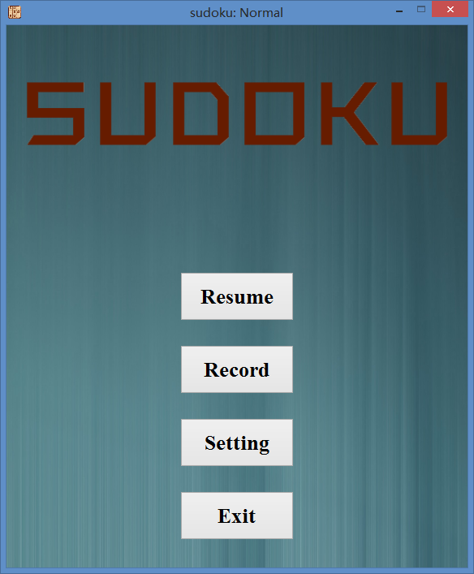
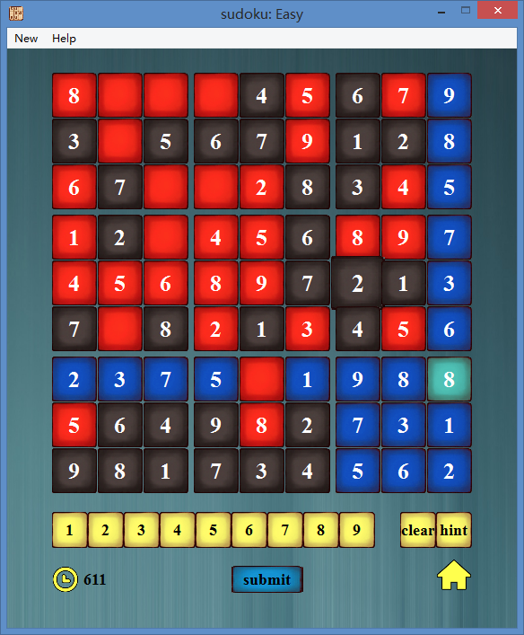

## 【Supported Commands】

BIN/sudoku.exe

| arguments | means |
|-----------|-------|
|-c N       | generate N sudoku-s|
|-s path    | solve sudoku puzzles in path file |
|-n <N> -m <M> (-u)  | generate N sudokus which mode is M, M = 1,2,3 (-u means every soduku has a unique solution or not) |
|-n <N> -r <N1>~<N2> (-u) | generate N sudokus and the number of empty grids is bewteen [N1, N2], 20 <= N1 <= N2 <= 55 |
|-help   | show the help menu |
 

##【GUI】

GUIBIN/sudokuGUI.exe

  
    
## 【Description】

1. Blog: [https://www.ohazyi.com/sudoku_2](https://www.ohazyi.com/sudoku_2)  or [http://www.cnblogs.com/ohazyi/p/7670382.html](http://www.cnblogs.com/ohazyi/p/7670382.html)

2. About: [http://www.cnblogs.com/jiel/p/7604111.html](http://www.cnblogs.com/jiel/p/7604111.html)
    

